# RISC-V Single-Cycle Processor

This project implements a RISC-V 32-bit Single-Cycle Processor with support for up to 37 instructions. The project is based on the textbook implementation of the RISC-V Single Cycle Datapath in Computer Organization and Design: RISC-V Edition by Patterson and Hennessy with some additional changes.

<div align="center">
    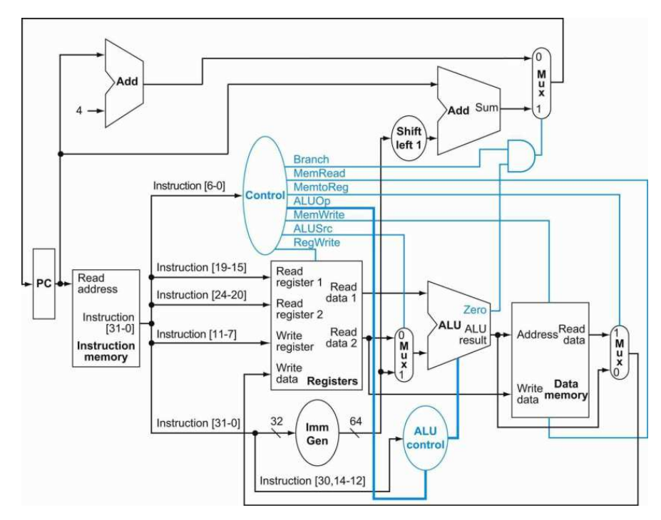
    <p><i>Image from Computer Organization and Design: RISC-V Edition by Patterson and Hennessy</i></p>
</div>

## Instruction Set 
The base instruction set RV32I is implemented with support for the following 37 instructions:

| Instruction | Format | Opcode (`opcode`) | Funct3 (`funct3`) | Funct7 (`funct7`) | Usage |
| :--- | :---: | :---: | :---: | :---: | :--- |
| `add` | R-type | `0110011` | `000` | `0000000` | ADD rd, rs1, rs2 |
| `addi` | I-type | `0010011` | `000` | N/A | ADDI rd, rs1, imm |
| `and` | R-type | `0110011` | `111` | `0000000` | AND rd, rs1, rs2 |
| `andi` | I-type | `0010011` | `111` | N/A | ANDI rd, rs1, imm |
| `auipc` | U-type | `0010111` | N/A | N/A | AUIPC rd, imm |
| `beq` | B-type | `1100011` | `000` | N/A | BEQ rs1, rs2, offset |
| `bge` | B-type | `1100011` | `101` | N/A | BGE rs1, rs2, offset |
| `bgeu` | B-type | `1100011` | `111` | N/A | BGEU rs1, rs2, offset |
| `blt` | B-type | `1100011` | `100` | N/A | BLT rs1, rs2, offset |
| `bltu` | B-type | `1100011` | `110` | N/A | BLTU rs1, rs2, offset |
| `bne` | B-type | `1100011` | `001` | N/A | BNE rs1, rs2, offset |
| `jal` | J-type | `1101111` | N/A | N/A | JAL rd, offset |
| `jalr` | I-type | `1100111` | `000` | N/A | JALR rd, rs1, offset |
| `lb` | I-type | `0000011` | `000` | N/A | LB rd, offset(rs1) |
| `lbu` | I-type | `0000011` | `100` | N/A | LBU rd, offset(rs1) |
| `lh` | I-type | `0000011` | `001` | N/A | LH rd, offset(rs1) |
| `lhu` | I-type | `0000011` | `101` | N/A | LHU rd, offset(rs1) |
| `lui` | U-type | `0110111` | N/A | N/A | LUI rd, imm |
| `lw` | I-type | `0000011` | `010` | N/A | LW rd, offset(rs1) |
| `or` | R-type | `0110011` | `110` | `0000000` | OR rd, rs1, rs2 |
| `ori` | I-type | `0010011` | `110` | N/A | ORI rd, rs1, imm |
| `sb` | S-type | `0100011` | `000` | N/A | SB rs2, offset(rs1) |
| `sh` | S-type | `0100011` | `001` | N/A | SH rs2, offset(rs1) |
| `sll` | R-type | `0110011` | `001` | `0000000` | SLL rd, rs1, rs2 |
| `slli` | I-type | `0010011` | `001` | `0000000` | SLLI rd, rs1, shamt |
| `slt` | R-type | `0110011` | `010` | `0000000` | SLT rd, rs1, rs2 |
| `slti` | I-type | `0010011` | `010` | N/A | SLTI rd, rs1, imm |
| `sltiu` | I-type | `0010011` | `011` | N/A | SLTIU rd, rs1, imm |
| `sltu` | R-type | `0110011` | `011` | `0000000` | SLTU rd, rs1, rs2 |
| `sra` | R-type | `0110011` | `101` | `0100000` | SRA rd, rs1, rs2 |
| `srai` | I-type | `0010011` | `101` | `0100000` | SRAI rd, rs1, shamt |
| `srl` | R-type | `0110011` | `101` | `0000000` | SRL rd, rs1, rs2 |
| `srli` | I-type | `0010011` | `101` | `0000000` | SRLI rd, rs1, shamt |
| `sub` | R-type | `0110011` | `000` | `0100000` | SUB rd, rs1, rs2 |
| `sw` | S-type | `0100011` | `010` | N/A | SW rs2, offset(rs1) |
| `xor` | R-type | `0110011` | `100` | `0000000` | XOR rd, rs1, rs2 |
| `xori` | I-type | `0010011` | `100` | N/A | XORI rd, rs1, imm |

## Project Structure

```
RISCV-Single-Cycle-Datapath/
├── Fetch/
│   ├── fetch.sv              
│   ├── pc.sv                 
│   ├── pc_adder.sv           
│   └── instr_mem.sv          
│
├── Decode/
│   ├── decode.sv              
│   ├── control_unit.sv        
│   ├── register_file.sv       
│   └── immediate_gen.sv       
│
├── Execute/
│   ├── execute.sv             
│   ├── alu.sv                 
│   ├── alu_control.sv         
│   └── branch_adder_mux.sv    
│
├── Memory/
│   ├── memory.sv               
│   └── data_mem.sv             
│
├── WriteBack/
│   └── write_back.sv          
│
├── top_rv32_scdp.sv           # Top-level module (synthesizable)
├── tb_top_rv32_scdp.sv        # riscv-tests runner testbench
│
├── Testbenches/                # Per-module/per-stage unit testbenches
│
├── Simulation/                  # Simulation console output + waveform screenshots
│   ├── SIM_Fetch/
│   ├── SIM_Decode/
│   ├── SIM_Execute/
│   ├── SIM_Memory/
│   ├── SIM_WriteBack/
│   └── SIM_SCDP/
│
├── Images/                      # README images (datapath diagram, synthesis screenshots)
│
├── elf_binaries/                 # riscv-tests rv32ui-p-* ELF binaries + .dump files
│
├── run_riscv_tests.py            # Batch test runner (ELF -> hex -> QuestaSim -> pass/fail report)
├── elf2hex.py                    # ELF-to-hex converter (instruction + data sections)
│
├── venv/                         # Python virtual environment (pyelftools)
└── README.md
```

## Verification

This processor was tested with the <a href="https://github.com/riscv-software-src/riscv-tests">`riscv-tests`</a> repository's rv32ui-p-* assembly programs. I used the ELF binaries present in the forked version of this repository <a href="https://github.com/wokwi/riscv-tests-precompiled">`riscv-tests-precompiled`</a>. It should be noted that the riscv-tests suite relies on FENCE and ECALL for testing which are treated as no-op in this processor. FENCE is a no-op here in single-cycle because it only has in-order execution. The ECALL instruction is called at the end of each test program and is caught by the testbench. Each program sets the a0 and gp registers of the CPU which are read by the testbench to determine whether test passes or fails. All tests are run by a Python script. 

<div align="center">
    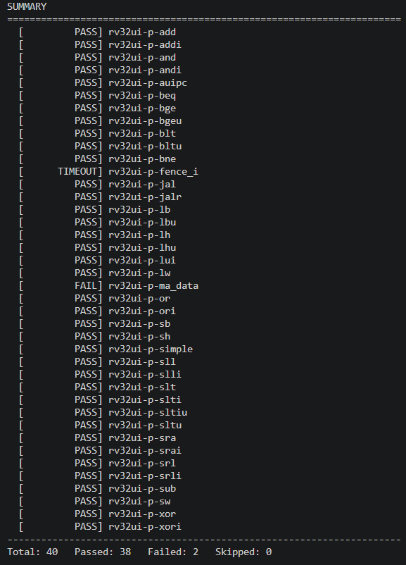
    <p><i>Portion of the final script's output. Full output can be found in `Simulation/SIM_SCDP/output.txt`</i></p>
    <br>
</div>

Additionally, each specific module and stage has been tested and verified itself with its own testbench module. Images of console outputs and simulation for each module and integrated stages can be found in the Simulation folder. 

Following are the console outputs of each stage and the console output and simulation of one test on the integrated SCDP: 

<div align="center">
    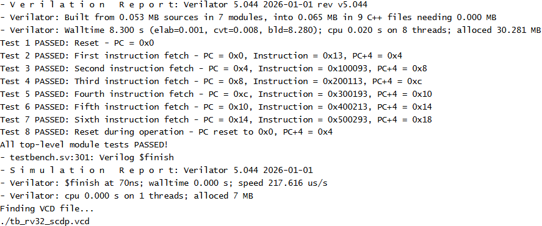
    <p><i>Fetch Stage Output</i></p>
</div>

<div align="center">
    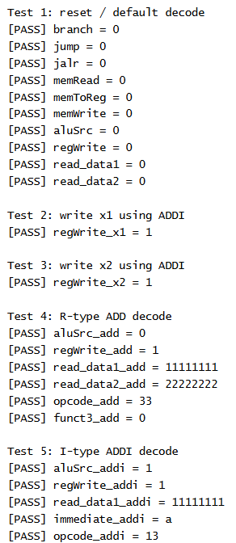
    <p><i>Decode Stage Output 1</i></p>
</div>

<div align="center">
    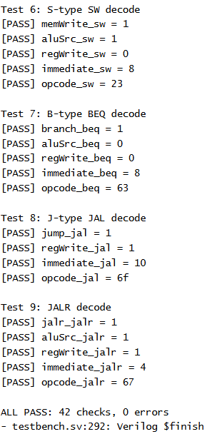
    <p><i>Decode Stage Output 2</i></p>
</div>

<div align="center">
    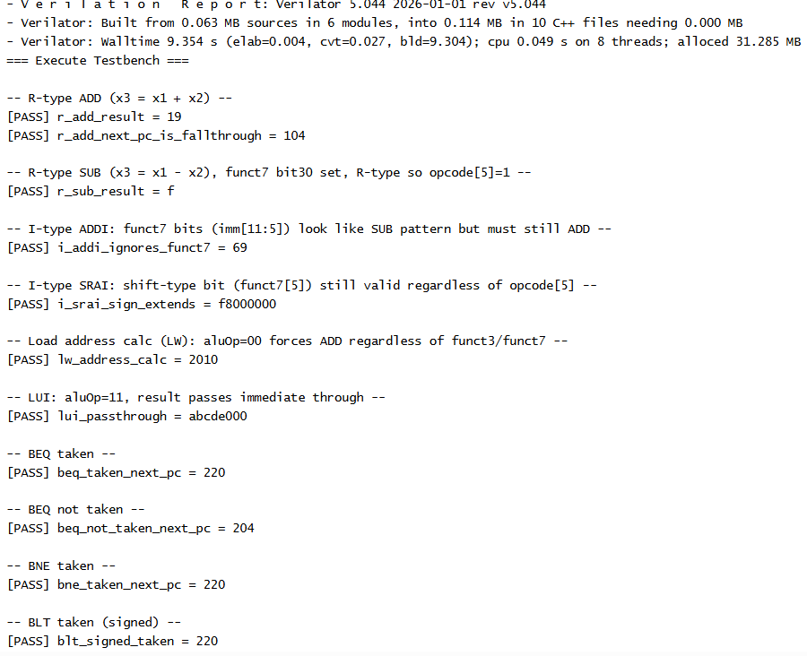
    <p><i>Execute Stage Output 1</i></p>
</div>

<div align="center">
    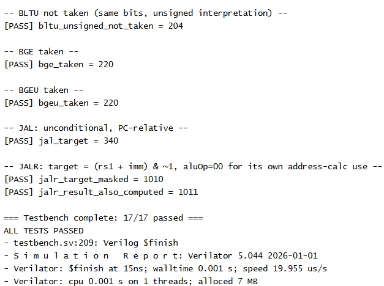
    <p><i>Execute Stage Output 2</i></p>
</div>

<div align="center">
    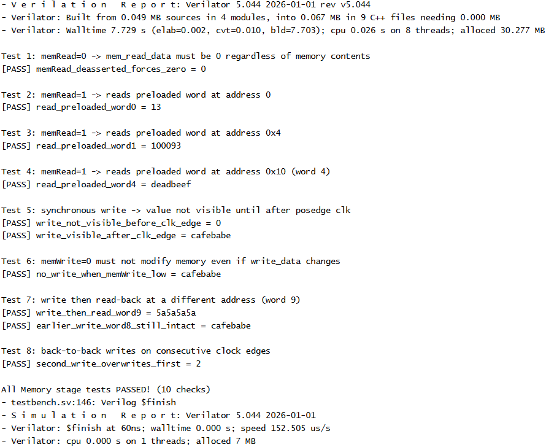
    <p><i>Memory Stage Output</i></p>
</div>

<div align="center">
    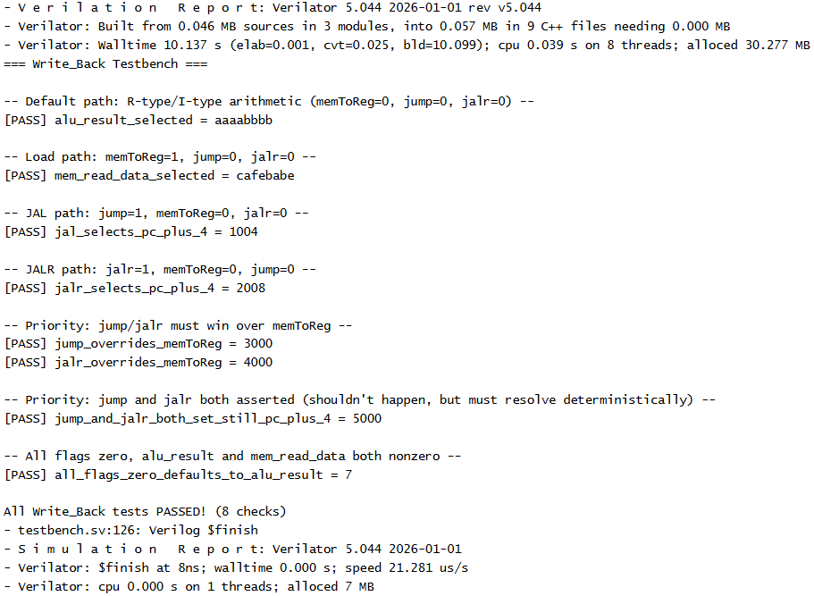
    <p><i>Write Back Stage Output</i></p>
</div>

<div align="center">
    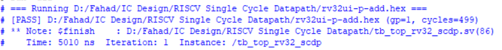
    <p><i>SCDP Add Test Console Output</i></p>
</div>

<div align="center">
    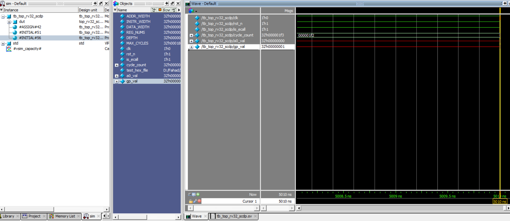
    <p><i>SCDP Add Test Simulation</i></p>
</div>

## Python Script

The Python script `run_riscv_tests.py` is responsible for converting these ELF binaries into instruction and data hex files and running individual tests on all converted hex files using QuestaSim. The resultant hex files will be stored in the sim_run directory.

This script supports the following arguments:

| Flag | Purpose |
|---|---|
| `--tests-dir` | Folder containing the `rv32ui-p-*` ELF binaries to test |
| `--design-dir` | Root folder to recursively search for `.sv` design/testbench files |
| `--sim-dir` | Working directory for the Questa `work` library and generated hex files (default: `./sim_run`) |
| `--exclude` | Substrings to skip when auto-discovering `.sv` files (default: `Testbenches`, `no_tb_top_rv32_scdp.sv`) |
| `--vlib` | Path to the `vlib` executable, if not on `PATH` |
| `--vlog` | Path to the `vlog` executable, if not on `PATH` |
| `--vsim` | Path to the `vsim` executable, if not on `PATH` |
| `--timeout` | Per-test wall-clock timeout in seconds (default: 120) |
| `--skip-compile` | Reuse an existing `work` library instead of recompiling (only safe if no `.sv` file changed since) |
| `--filter` | Only run tests whose filename contains this substring |


## Quartus Synthesis

This processor was synthesized using the Quartus Lite software.

<div align="center">
    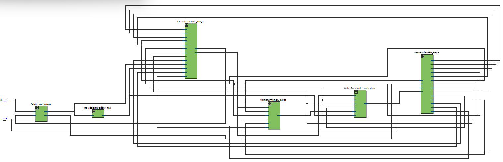
        <p><i>Synthesized SCDP</i></p>
    <br>
</div>

<div align="center">
    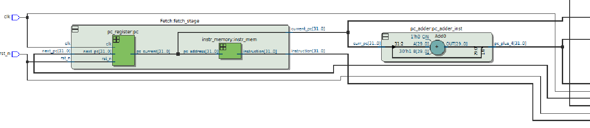
    <p><i>Closer Look of the Circuit 1</i></p>
    <br>
</div>

<div align="center">
    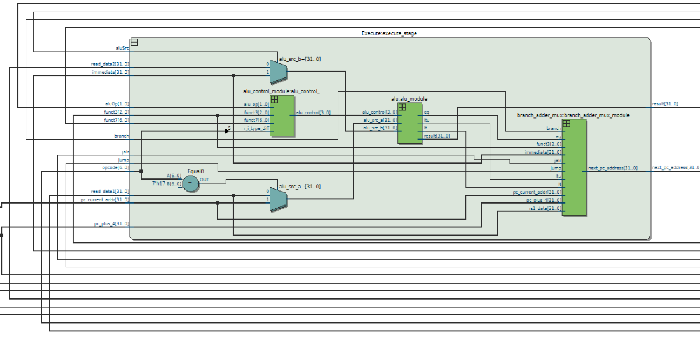
    <p><i>Closer Look of the Circuit 2</i></p>
    <br>
</div>

<div align="center">
    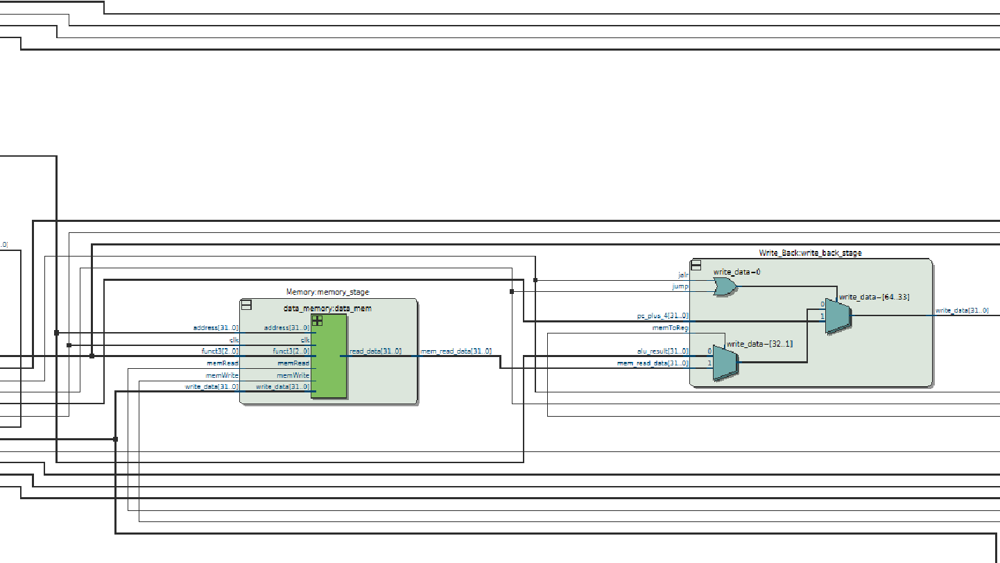
    <p><i>Closer Look of the Circuit 3</i></p>
    <br>
</div>

<div align="center">
    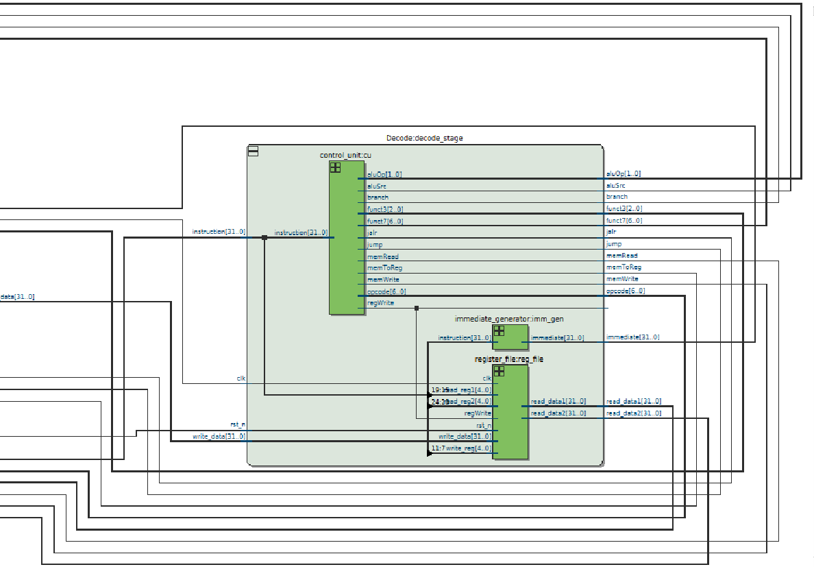
    <p><i>Closer Look of the Circuit 4</i></p>
    <br>
</div>

## Limitations

This processor passed 38 out of the 40 tests present for the base RV32I instructions present in the <a href="https://github.com/riscv-software-src/riscv-tests">`riscv-tests`</a> repository. The two tests that failed are for the fence.i and ma-data tests. fence.i test would require a unified instruction and data memory which goes against Harvard Architecture implemented in our CPU whereas ma-data tests for misaligned data access and cross-word data reads not supported by the CPU.  

## How To Run The SCDP Yourself

To run this RISC-V Single-Cycle Processor yourself:
1) Install Questa/ModelSim, Python and pyelftools.
2) Clone this repository
3) Run `python run_riscv_tests.py --tests-dir ./elf_binaries --design-dir .` in the repository

## Acknowledgments

- [riscv-tests](https://github.com/riscv-software-src/riscv-tests) — RISC-V ISA compliance tests used to verify this processor
- [riscv-tests-precompiled](https://github.com/wokwi/riscv-tests-precompiled) — precompiled ELF binaries for the above, used in place of building the full RISC-V GNU toolchain
- *Computer Organization and Design: RISC-V Edition* by David A. Patterson and John L. Hennessy — primary reference for the single-cycle datapath architecture
